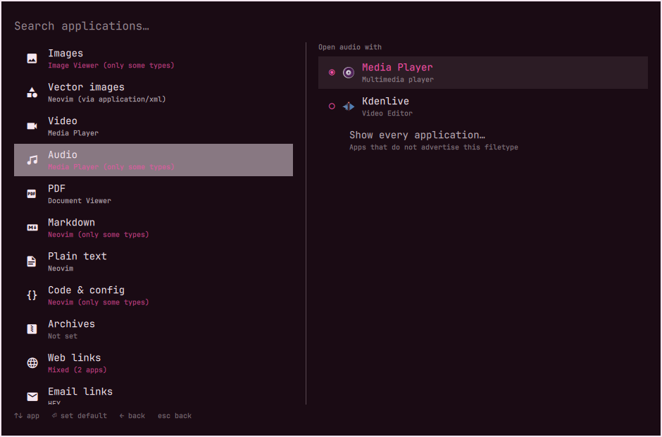

# Default Applications

A summoned overlay for choosing which application opens which filetype.
Left pane: filetype groups and the app each one currently opens in.
Right pane: the apps that can take it.



- **Plugin ID:** `io.github.kimm-stensborg.mimetypes`
- **Kind:** `overlay`
- **License:** MIT
- **Requires:** Omarchy 4 (Quattro) with `omarchy-shell`

## Dependencies

All three ship with Omarchy and are already present on a stock install:

| Package | Used for |
|---------|----------|
| `python` | `scan.py`, the helper that reads the desktop-entry database |
| `xdg-utils` | `xdg-mime default`, which performs every assignment |
| `shared-mime-info` | the MIME subclass and glob databases |

Nothing is downloaded or installed at runtime.

## Install

```bash
omarchy plugin add https://github.com/kimm-stensborg/omarchy-plugin-mimetypes.git
omarchy plugin enable io.github.kimm-stensborg.mimetypes
```

`omarchy plugin add` clones into
`~/.config/omarchy/plugins/io.github.kimm-stensborg.mimetypes/` and leaves the
plugin disabled so the code can be reviewed before it runs. Plugins execute
unsandboxed inside `omarchy-shell`.

Then open it:

```bash
omarchy-shell shell summon io.github.kimm-stensborg.mimetypes '{}'
```

Add a menu entry by putting this in
`~/.config/omarchy/extensions/omarchy-menu.jsonc` (it hot-reloads on save),
which puts it under **Setup → Defaults → Filetypes**:

```jsonc
"setup.default.filetypes": {
  "icon": "󰈔",
  "label": "Filetypes",
  "description": "Choose which application opens each filetype",
  "aliases": ["mimetypes", "default-apps", "associations"],
  "action": "omarchy-shell shell summon io.github.kimm-stensborg.mimetypes '{}'"
},
```

Or bind a key in `~/.config/hypr/bindings.lua`.

## Remove

```bash
omarchy plugin remove io.github.kimm-stensborg.mimetypes
```

That deletes the plugin directory. Two things it leaves behind on purpose,
because both are your data rather than the plugin's:

- `~/.config/mimeapps.list` — the assignments themselves. They are standard
  XDG defaults that every other tool reads, so removing the plugin does not
  change what opens your files. Delete individual lines to undo them.
- `~/.config/omarchy/mimetypes.json` — any filetypes you added by hand.
  Safe to delete.

Also remove the `setup.default.filetypes` entry from
`~/.config/omarchy/extensions/omarchy-menu.jsonc` if you added one.

## Usage

```bash
omarchy-shell shell summon io.github.kimm-stensborg.mimetypes '{}'
omarchy-shell shell summon io.github.kimm-stensborg.mimetypes '{"filter":"pdf"}'   # open on a group
```

## Keys

| Key | Filetype pane | Application pane |
|-----|---------------|------------------|
| `↑` `↓` | move | move |
| `→` / `Tab` | into the app list | — |
| `←` / `Tab` | — | back to filetypes |
| `⏎` | open the app list | set as default |
| type | filter filetypes | filter applications |
| `Del` | remove an added filetype (asks first) | — |
| `Esc` | clear filter, then close | clear filter, then back |

Each pane keeps its own filter, and the selected filetype is tracked by
identity rather than row position — so editing a filter never retargets an
assignment at whatever moved into that row.

## What it writes

Assignments go through `xdg-mime default`, which writes
`~/.config/mimeapps.list`. Nothing else on the system is touched, and any
other tool that reads that file sees the same result.

A group sets every MIME type it lists in one action ("Images" covers PNG,
JPEG, WebP and the rest), so the subtitle can report a state the group as a
whole is in:

- **Neovim** — every type in the group points there
- **Neovim (via text/plain)** — nothing is registered for the type itself;
  it inherits from a parent type, and would follow that parent if it changed
- **Neovim (only some types)** — some types in the group have no default
- **Mixed (2 apps)** — types in the group disagree
- **Not set** — no default, direct or inherited

The application list puts declared handlers first — apps whose `.desktop`
advertises the type, or a parent of it. **Show every application…** reveals
the rest, which is how a terminal editor or any app with no `MimeType=` line
gets picked.

## Adding a filetype

**Add a filetype…** at the end of the list accepts an extension (`.kra`) or a
MIME type (`application/x-krita`). Extensions resolve against the
shared-mime-info glob database. Added rows live in
`~/.config/omarchy/mimetypes.json`, which is meant to be hand-editable:

```json
{
  "custom": [
    { "label": "Krita images", "mimes": ["application/x-krita"] }
  ]
}
```

A row may carry several MIME types, and they will be set together. A type
already covered by a built-in group is refused, so two rows can never fight
over one registration.

`Del` removes an added row from the picker, after the same confirm the
Omarchy menu shows before uninstalling an app. It deliberately does **not**
unset the default that row assigned — hiding a row from a list is not a
request to change what opens those files. Remove the line from
`~/.config/mimeapps.list` to do that.

## Files

| Path | What |
|------|------|
| `MimeTypes.qml` | the overlay: panes, keys, theming |
| `Model.js` | filetype groups, default resolution, search, sorting |
| `scan.py` | `scan` / `set` / `resolve` — the only code that touches the system |

`scan.py` reads the desktop-entry and mimeapps.list search paths itself
rather than shelling out per MIME type, so a full scan of ~100 apps costs
about 50ms. `set` delegates to `xdg-mime` instead of editing the file
directly.

Note that `.pragma library` JS and QML components are cached per shell
process: after editing `Model.js`, run `omarchy restart shell` rather than
relying on plugin hot-reload.
